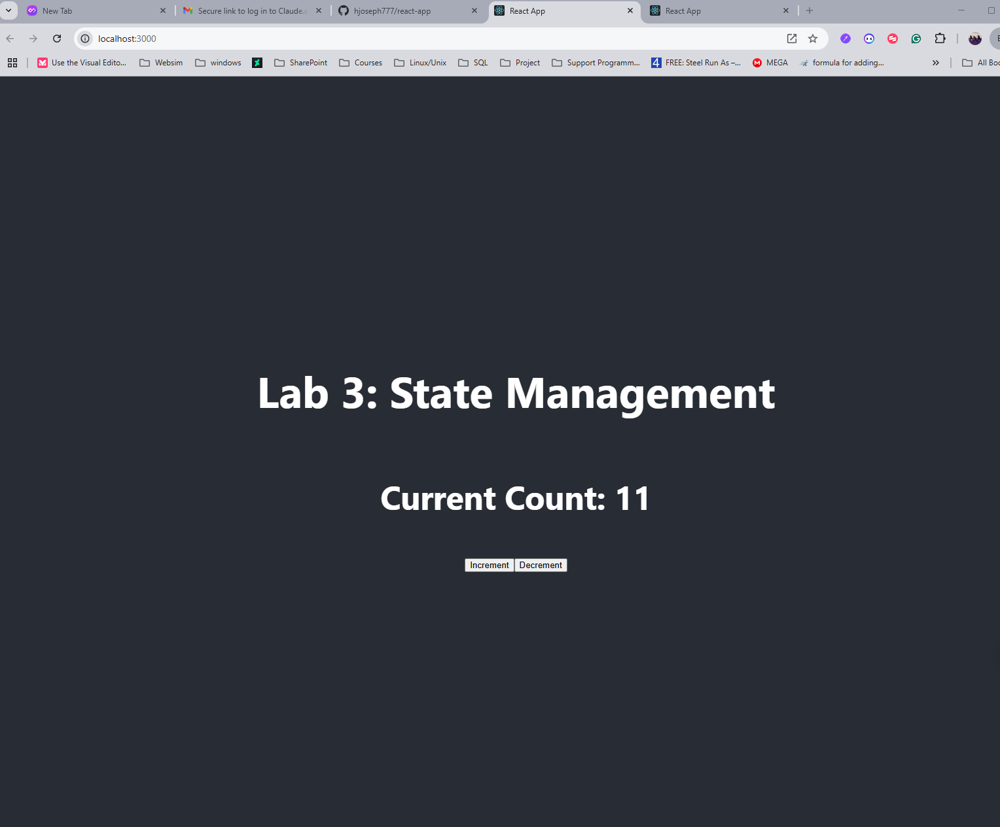

# Advanced Web Programming Lab 3
### `npm start`

Runs the app in the development mode.\
Open [http://localhost:3000](http://localhost:3000) to view it in your browser.

The page will reload when you make changes.\
You may also see any lint errors in the console.

## Code Explanation

### Counter.js

The `Counter.js` file contains the code for a simple counter component. It includes functionality to increment and decrement a counter value. You can view the code [here](./src/Counter.js).

### App.js

The `App.js` file is the main component of the application. It integrates the `Counter` component and manages the overall layout and state of the app. You can view the code [here](./src/App.js).

## Screenshots

Below is an image showing the output of the application:

